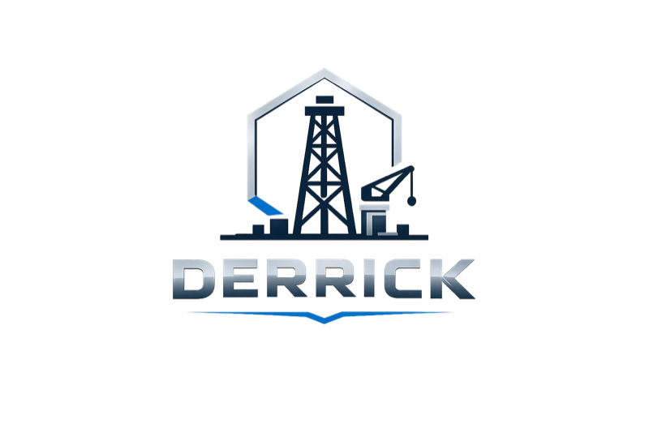

<div align="center">
  
</div>

---

> *The load-bearing tower over an oil well — the structure that lifts every length of pipe in and out of the hole.*

[](https://github.com/lgulliver/derrick/actions/workflows/ci.yml)
[](https://www.rust-lang.org)
[](./LICENSE)

**derrick** is a Rust CLI that turns a single command into a full dark-factory feature pipeline — spec, adversarial review, tickets, dispatch, PR stacking — without asking you to wire each underlying tool by hand.

```bash
derrick add "build a webhook ingest endpoint with idempotent dedupe"
```

That one line walks the entire pipeline, remembers what it learns about your codebase, compresses everything that crosses a model boundary, and runs independent work in parallel. One binary, SQLite, no daemon required.

---

## How it works

```
derrick add "description"
      │
      ▼
  clarify ──► plan ──► checkpoint ──► assay (adversarial review)
                                          │
                                          ▼
                               analyze ──► tasks ──► bridge
                                                         │
                                                         ▼
                                                  foreman (dispatch)
                                                         │
                                           ┌─────────────┴─────────────┐
                                           ▼                           ▼
                                       hand A                      hand B
                                    (git worktree)              (git worktree)
```

Every step is configured in your repo's `derrick.yaml`. Skip any step at invocation time (`--no-clarify`, `--no-assay`, `--dry-run`) or remove it from the pipeline entirely.

---

## The three pillars

### 🧠 Memory
derrick seeds and curates persistent agent memory so the assistant builds on what it already knows about your codebase. Tiered retrieval surfaces the right context at the right time — no relearning the rig on every turn.

### ⚡ Tokens
Every byte across a model boundary earns its place.

| What | How | Typical saving |
|---|---|---|
| **Scrub** | Strips CLI noise (progress bars, spinners, ANSI codes) before tool output reaches the model | **88% on `git fetch`**, 94% on `cargo build` |
| **Caveman** | Compresses verbose prose in inter-step handoffs (lite / full / ultra) | **62% at Full** on typical AI-generated text |
| **Model tiering** | Routes cheap steps to lighter models; expensive reasoning to frontier models | Configurable per pipeline step |
| **Prompt caching** | Anthropic cache headers on repeated context | Up to 90% on repeated prefixes |

Scrub and caveman fire automatically at every model boundary via Claude Code / Codex hooks written by `derrick init`.

### 🔀 Parallelism
Independent work runs concurrently. Each `/add-feature` run gets an isolated git worktree. The foreman dispatches multiple hands (agents) in parallel. Multi-reviewer assay runs reviewers sequentially today (true fan-out once the executor is `Arc`-wrapped, §9.C.5).

---

## Getting started

```bash
curl -fsSL https://raw.githubusercontent.com/lgulliver/derrick/main/scripts/install.sh | bash
```

Supports macOS (Apple Silicon + Intel) and Linux (x86\_64). Homebrew tap and Windows support coming in v1.1.

> **Rust-native?** `cargo install --git https://github.com/lgulliver/derrick derrick-cli` also works.

Then adopt a repo:

```bash
cd ~/repos/my-project
derrick init                     # brownfield-safe: won't clobber your AGENTS.md
derrick doctor                   # checks toolchain, hooks, squash-merge policy
derrick foreman start --attached # start the dispatch loop
```

Start a feature:

```bash
derrick add "build a webhook ingest endpoint with idempotent dedupe"

# Skip steps you don't need right now
derrick add "fix the auth token refresh race" --no-clarify --no-assay

# Dry run to see the plan without executing
derrick add "refactor the rate limiter" --dry-run
```

Or trigger from inside Claude Code with `/add-feature` (maps to the same pipeline).

---

## CLI reference

```
derrick <COMMAND>

PIPELINE
  add          Run the full pipeline — prompt is a positional argument
  init         Adopt a repo (brownfield-safe, VS Code / JetBrains opt-in)
  run          add-feature — canonical form of `add` (scripts / CI)
  foreman      start / stop / tick the dispatch loop

VISIBILITY
  status       Current batch, in-flight tickets, foreman state
  observe      Live ratatui dashboard (6 tabs: overview, tickets, stack,
               activity, tokens, memory)
  doctor       Toolchain and config health check

TICKET MANAGEMENT
  ticket       done / review / code-review / list / show / reject / reopen / block

STACKING
  stack        show / restack / submit — PR stack management

TOKEN TOOLS
  scrub        Filter CLI noise from stdin (git, cargo, claude, gh, ...)
  caveman      Compress verbose prose from stdin (lite / full / ultra)
  gain         Show scrub and caveman status

SHELL
  completions  Generate shell completions (bash / zsh / fish / elvish / powershell)
  uninstall    Remove derrick from a repo
```

### Token tools in action

```bash
# Strip git fetch noise before feeding output to a model
git fetch 2>&1 | derrick scrub git

# Compress an inter-step summary
echo "I would like to let you know that in order to..." | derrick caveman --intensity full

# Show what's active
derrick gain
```

---

## Architecture

17 crates, one binary:

| Crate | Role |
|---|---|
| `derrick-cli` | Binary, all subcommands |
| `derrick-flow` | Pipeline executor, state machine, multi-reviewer assay |
| `derrick-config` | Typed schema, layered loader, 14 validation rules |
| `derrick-scrub` | CLI noise filter — rules for git, gh, claude, codex, copilot, cargo |
| `derrick-caveman` | Prose compressor — lite / full / ultra intensities |
| `derrick-memory` | Tiered retrieval, tag index, lesson curation |
| `derrick-tui` | ratatui dashboard (6 tabs) |
| `derrick-observe` | TUI wiring, stack refresh, event loop |
| `derrick-stack` | PR stacking (native / Graphite / git-spice) |
| `derrick-models` | Shared domain types |
| `derrick-adopt` | Brownfield adoption — detects AGENTS.md, writes hooks |
| `derrick-substrate` | Host abstraction (trait) |
| `derrick-substrate-native` | Native Rust host impl |
| `derrick-claude` | Claude substrate |
| `derrick-copilot` | Copilot substrate |
| `derrick-assay` | Adversarial plan reviewer |
| `derrick-tools` | Shared tool utilities |

---

## Supported model providers

`anthropic` · `openai` · `gemini` · `bedrock` · `azure-openai` · `ollama` · `copilot-cli`

**Hosts:** `claude` · `codex` · `copilot` · `opencode`

Configured per pipeline step in `derrick.yaml`. Bring your own model on any step.

---

## Status

**Active development.** Architecture and 41 decisions in [DESIGN.md](./DESIGN.md).

What's landed and tested:

- ✅ `derrick add` — positional-prompt shorthand; `run add-feature` for scripts
- ✅ Full pipeline executor with multi-reviewer assay and `parallel_group` steps
- ✅ Foreman dispatch loop (attached and detached daemon)
- ✅ Ticket state machine (ready → in-flight → in-review → done / blocked / rejected)
- ✅ `derrick ticket code-review` — adversarial pre-PR code review with auto-remediation loop
- ✅ Per-run isolated git worktrees (`.derrick/worktrees/<run-id>/`) for parallel safety
- ✅ Token tracking per pipeline step + cost estimates — `derrick gain --run <id>` for per-step breakdown
- ✅ `derrick scrub` with 80%+ reduction on git and cargo output
- ✅ `derrick caveman` with 60%+ reduction at Full intensity on verbose prose
- ✅ `derrick observe` — live ratatui dashboard
- ✅ Tiered memory with tag index and lesson retrieval
- ✅ `derrick init` — brownfield-safe, VS Code + JetBrains opt-in, Codex instructions
- ✅ `derrick doctor` — live squash-merge policy check via GitHub API
- ✅ PR stacking: `stack show / restack / submit`
- ✅ Shell completions (bash / zsh / fish / elvish / powershell)
- ✅ `scripts/install.sh` — curl-able, platform-detecting (linux-x86\_64, macos-arm64, macos-x86\_64)
- ✅ GitHub release workflow — builds on `v*` tag push, attaches binaries + checksums
- ✅ `marketplace.json` — Claude Code plugin discovery
- 🔜 Homebrew tap (v1.1)
- ✅ Per-session token telemetry in `derrick gain` — `derrick gain --run <id>` for per-step breakdown
- 🔜 True parallel fan-out for multi-reviewer assay

431 tests passing across 17 crates.

---

## Read next

- [DESIGN.md](./DESIGN.md) — full architecture, pipeline schema, and all 41 decisions
- [AGENTS.md](./AGENTS.md) — operational contract for agents building derrick
- [CONTRIBUTING.md](./CONTRIBUTING.md) — engineering standards and PR workflow

---

## License

MIT — see [LICENSE](./LICENSE).
